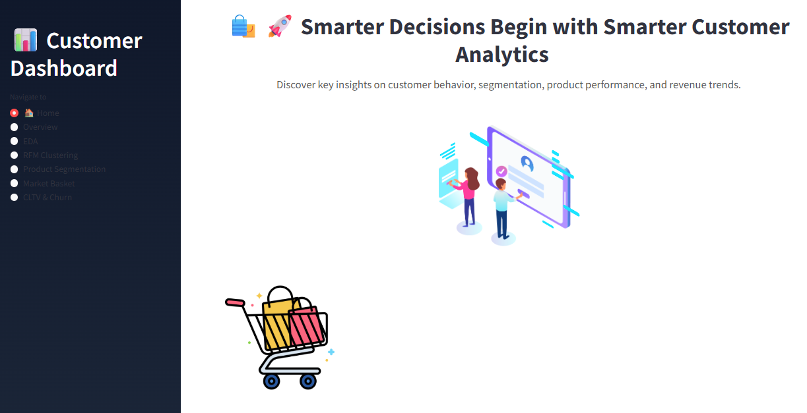
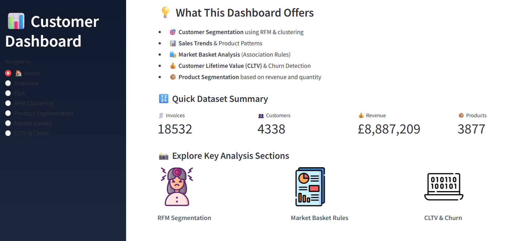
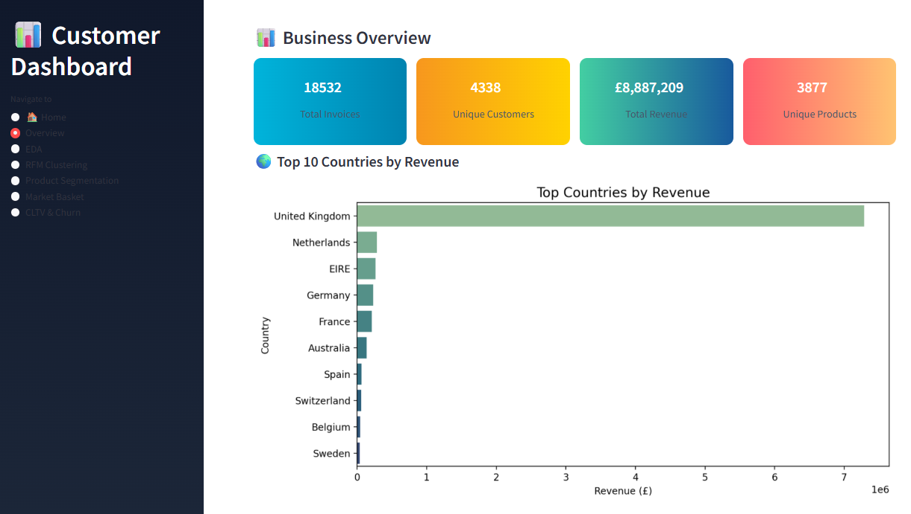
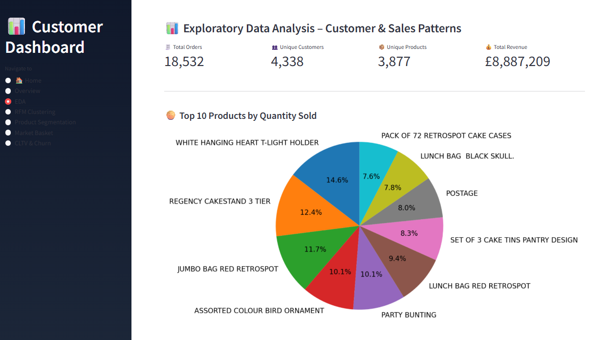
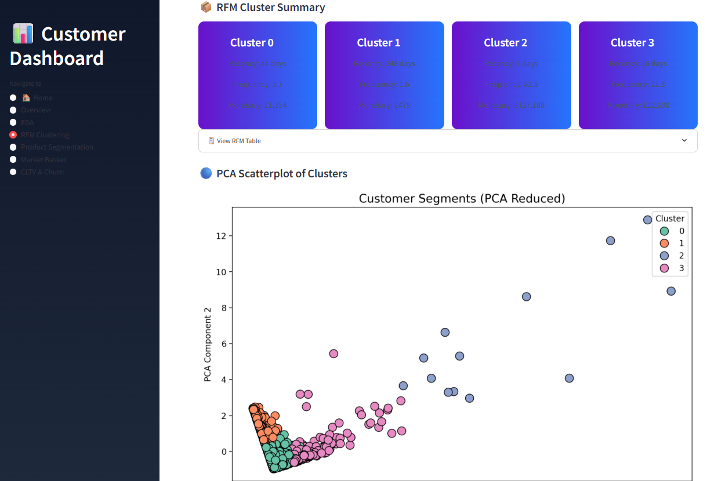
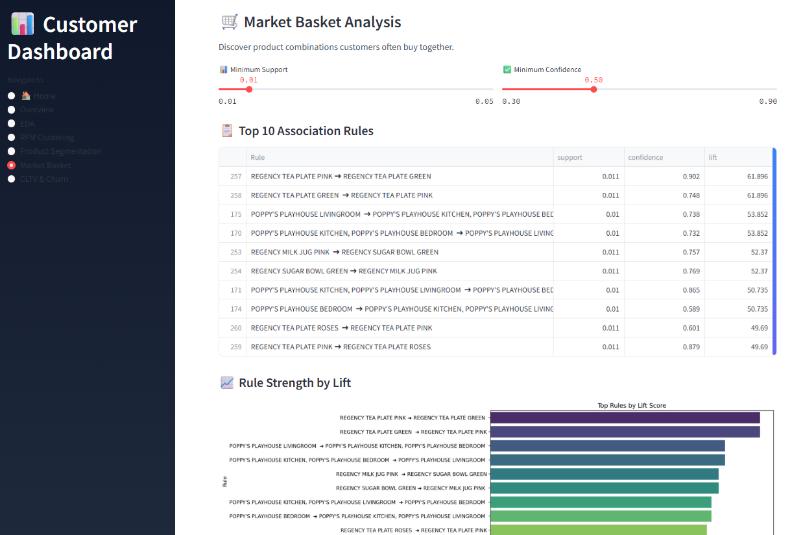
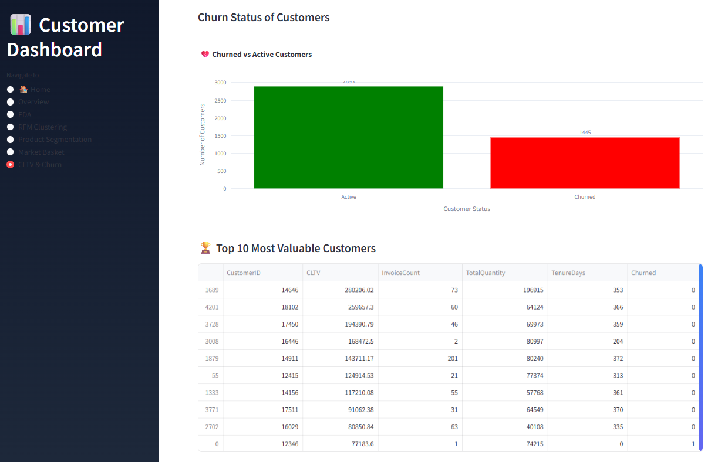

# 🛍️ Customer Intelligence Dashboard

An interactive and modern **Streamlit dashboard** that uncovers valuable insights from online retail data. 
This tool empowers businesses to understand customer behavior, segment their audience, analyze product trends, and increase revenue with actionable intelligence.

---

## 🚀 Key Features

- 📊 **Business Overview** – Track invoices, revenue, and product performance  
- 📈 **Summary & EDA** – Explore trends, top countries, and shopping patterns  
- 🧠 **Customer Segmentation (RFM)** – Identify high-value and loyal customers  
- 📦 **Product Clustering** – Group similar products using purchase behavior  
- 🛒 **Market Basket Analysis** – Discover commonly bought product pairs  
- 💰 **CLTV & Churn Prediction** – Estimate lifetime value and churn risk  
- 🎨 **Modern UI** – Enhanced with Lottie animations, color themes, and custom layouts  

---

## 📁 Dataset

- `Online Retail.xlsx`  
A real transactional dataset containing thousands of online purchases from a UK-based retailer.

---

## 🌐 Live Dashboard

🔗 [Explore the Live App](https://customer-intelligence.streamlit.app)

---
## 📷 App Previews

> Below are clean visual highlights from the deployed dashboard. All major sections are captured.

- 🏠 **Home**  
  

- 📊 **Summary Section**  
  

- 📈 **Overview Section**  
  

- 🔍 **Exploratory Data Analysis (EDA)**  
  

- 🧠 **RFM Clustering**  
  

- 📦 **Product Segmentation**  
  

- 🛒 **Market Basket Analysis**  
  
  
---

## 🛠️ Tech Stack

- **Frontend:** Streamlit, HTML/CSS  
- **Visualization:** Plotly, Seaborn, Matplotlib  
- **Data Handling:** Pandas, NumPy  
- **ML & Analysis:** Scikit-learn, mlxtend, NetworkX  

---

## 📬 Contact

Crafted by **Raju Yadav** — Data Science & AI Enthusiast  
📧 Email: [mr.rajuyadav002@gmail.com](mailto:mr.rajuyadav002@gmail.com)  
🔗 GitHub: [raju-datascience](https://github.com/raju-datascience)

---

> ⚡ **Pro Tip:** Use the sidebar in the app to explore key customer and product intelligence insights — all in one place!